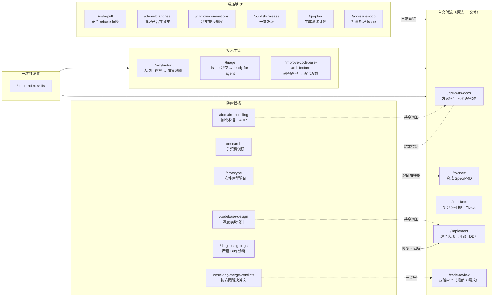

# Rolex Skills

AI 编程技能合集——把软件工程工作流打包好，让 Claude Code 按规范干活。

基于 [mattpocock/skills](https://github.com/mattpocock/skills) 中文化并补充了 6 个原创 skill。这些技能不是"氛围编程"——它们处理真实项目的复杂性和约束。

## 痛点

**1. AI 帮你写得快，但没有告诉你该写什么**

Agent 和开发者之间存在沟通鸿沟。**拷问 session** 是解决之道——让 Agent 在动手前先问透你的需求。`/grill-with-docs` 和 `/grill-me` 就是干这个的。前者还会产出共享词汇表（`CONTEXT.md`），让后续每次对话都更精准。

**2. 从零开始一个新功能，不知道先干什么后干什么**

没有标准流程，每次靠直觉操作。从模糊想法到交付代码，缺一不可：需求访谈 → 规范文档 → 拆分 ticket → 逐个实现 → 代码审查。`/ask-rolex` 路由器告诉你在当前阶段该用哪个 skill。

**3. 做到了，但不一定是你要的。代码跑起来了，但心里没底**

没有验证闭环，交付全靠感觉。需要：测试先行（红-绿-重构）、双轴代码审查（规范 + 需求吻合度）、结构化调试流程。`/tdd` 和 `/code-review` 是这道防线。

**4. 项目越写越乱，AI 加速了熵增**

AI 加速了编码速度，也加速了软件熵增。`/improve-codebase-architecture` 能帮你挽救混乱的代码库，`/codebase-design` 提供深度模块设计的纪律。建议每几天跑一次。

**5. 写完了，然后呢？**

缺少交付规范。发版怎么发？分支怎么清？提交怎么写？合并冲突怎么处理？原创 skill 覆盖了从 git 操作到发版的全流程，让收尾和开头一样规范。

> 软件工程基本功比以往任何时候都重要。这些技能不是让你不用思考——是让你把思考花在刀刃上。

## 工作流总览



## 技能一览

### Bootstrap（一次性，每个仓库执行一次）

| 命令 | 职责 |
|------|------|
| `/setup-rolex-skills` | 配置 Issue Tracker、Triage 标签、领域文档路径 |

### 主交付流（从想法到交付）

```
/grill-with-docs → /to-spec → /to-tickets → /implement → /code-review
```

| 命令 | 触发 | 职责 |
|------|------|------|
| `/grill-with-docs` | 手动 | 方案拷问 → 写入 CONTEXT.md（术语表）+ ADR |
| `/to-spec` | 手动 | 合成 Spec/PRD（Problem/Solution/User Stories/Seams） |
| `/to-tickets` | 手动 | 拆分为垂直切片 Ticket，声明阻塞关系 |
| `/implement` | 手动 | 逐一实现 Ticket，内部驱动 TDD → typecheck → 全量测试 → code-review 后提交 |
| `/code-review` | 自动/手动 | 双轴并行：Standards（规范） + Spec（需求吻合度） |

> `tdd` 是 implement 内部引擎，不是独立步骤。

### 接入主链的入口

| 命令 | 触发 | 职责 | 接入点 |
|------|------|------|--------|
| `/wayfinder` | 手动 | 超大模糊项目 → 决策地图 → 迷雾清除 | 接入 `/to-spec` |
| `/triage` | 手动 | Issue 分类验证 → ready-for-agent | 接入 `/implement` |
| `/improve-codebase-architecture` | 手动 | 扫描架构问题 → 报告 → 深化方案 | 接入拷问流程 |

### 独立工具

| 命令 | 触发 | 职责 |
|------|------|------|
| `/prototype` | 自动/手动 | 一次性原型验证设计想法 |
| `/diagnosing-bugs` | 自动/手动 | 严谨诊断：tight loop → 假设排序 → 修复 → 回归 |
| `/research` | 自动/手动 | 一手资料调研，输出带引用的 Markdown |
| `/resolving-merge-conflicts` | 自动/手动 | 按意图（非文本）解决合并冲突 |
| `/domain-modeling` | 自动/手动 | 打磨领域术语，更新 CONTEXT.md 和 ADR |
| `/codebase-design` | 自动/手动 | 深度模块设计词汇（module/interface/depth/seam） |

### 日常效率

| 命令 | 触发 | 职责 |
|------|------|------|
| `/grilling` | 自动/手动 | 拷问原语：一次一问的设计树访谈 |
| `/grill-me` | 手动 | 无代码库的轻量拷问（/grill-with-docs 无状态版） |
| `/handoff` | 自动 | 长会话压缩交接文档 |
| `/teach` | 手动 | 跨 session 长期教学 |

### 路由器

| 命令 | 触发 | 职责 |
|------|------|------|
| `/ask-rolex` | 手动 | 告诉你当前场景该用哪个 skill、什么顺序 |

## 🆕 原创技能

6 个原创 skill，覆盖 Git 操作到发版的完整运维链：

| 命令 | 职责 |
|------|------|
| `/safe-pull` ★ | 安全 git pull + rebase，自动 stash |
| `/clean-branches` ★ | 清理已合并的本地和远程分支 |
| `/git-flow-conventions` ★ | 分支命名、commit 格式、发版规范参考 |
| `/publish-release` ★ | 从 develop 一键发版 |
| `/qa-plan` ★ | 从 commit 生成 Step-by-Step 测试计划 |
| `/afk-issue-loop` ★ | 批量处理 ready-for-agent 的 Issue |

## 场景速查

| 你想做什么 | 依次敲 |
|-----------|--------|
| 新功能从零开始 | `/grill-with-docs` → `/to-spec` → `/to-tickets` → `/implement` × N |
| 修 Bug | `/triage` → `/diagnosing-bugs` → 修复 → 测试 |
| 重构模块 | `/improve-codebase-architecture` → 拷问 → 进入主流程 |
| 调研技术方案 | `/research` → `/grill-with-docs` → 进入主流程 |
| 快速验证想法 | `/prototype` → 如果可行 → 进入主流程 |
| 同步代码 | `/safe-pull` |
| 发版 | `/publish-release` |
| 不确定用哪个 | `/ask-rolex` |

详细用法见 [docs/usage-guide.md](docs/usage-guide.md)。

## 快速开始（30 秒）

三种安装方式，任选其一。

### 方式 A：npx skills（推荐，可编辑）

```bash
npx skills@latest add toRolex/rolex-skills
```

选择你要安装的技能，记得勾选 `/setup-rolex-skills`。然后在项目里运行：

```
/setup-rolex-skills
```

### 方式 B：Plugin（只读，自动更新）

```bash
# Claude Code 内执行：
/plugin marketplace add toRolex/rolex-skills
/plugin install rolex-skills@toRolex
```

然后同样运行 `/setup-rolex-skills`。

### 方式 C：Git 克隆（贡献者）

```bash
git clone https://github.com/toRolex/rolex-skills
cd rolex-skills
bash scripts/link-skills.sh
```

然后运行 `/setup-rolex-skills`。

## 协议

MIT — 自由使用，商业或个人均可。写
