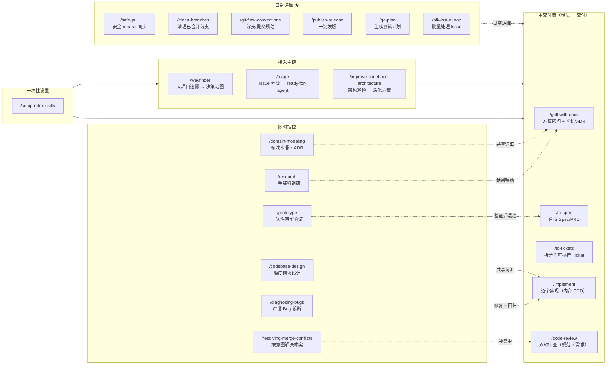

# Rolex Skills

AI 编程技能合集——把软件工程工作流打包好，让 Claude Code 按规范干活。

基础 [mattpocock/skills](https://github.com/mattpocock/skills) 中文化并补充了原创 skill 和技能守卫。这些技能不是"氛围编程"——它们处理真实项目的复杂性和约束。

## 痛点

**1. AI 帮你写得快，但没有告诉你该写什么**

Agent 和开发者之间存在沟通鸿沟。**拷问 session** 是解决之道——让 Agent 在动手前先问透你的需求。`/grill-with-docs` 和 `/grill-me` 就是干这个的。前者还会产出共享词汇表（`CONTEXT.md`），让后续每次对话都更精准。

**2. 从零开始一个新功能，不知道先干什么后干什么**

没有标准流程，每次靠直觉操作。从模糊想法到交付代码，缺一不可：需求访谈 → 规范文档 → 拆分 ticket → 逐个实现 → 代码审查。`/ask-rolex` 路由器告诉你在当前阶段该用哪个 skill。

**3. 做到了，但不一定是你要的。代码跑起来了，但心里没底**

没有验证闭环，交付全靠感觉。需要：测试先行（红-绿-重构）、双轴代码审查（规范 + 需求吻合度）、结构化调试流程。`/tdd` 和 `/code-review` 是这道防线。

**4. 项目越写越乱，AI 加速了熵增**

AI 加速了编码速度，也加速了软件熵增。`/improve-codebase-architecture` 能帮你挽救混乱的代码库，`/codebase-design` 提供深度模块设计的纪律。建议每几天跑一次。

**5. 写完了，然后呢？**

缺少交付规范。发版怎么发？分支怎么清？提交怎么写？合并冲突怎么处理？原创 skill 覆盖了从 git 操作到发版的全流程，让收尾和开头一样规范。

> 软件工程基本功比以往任何时候都重要。这些技能不是让你不用思考——是让你把思考花在刀刃上。

## 工作流总览


```mermaid
flowchart LR
    subgraph Bootstrap["一次性设置"]
        setup["/setup-rolex-skills"]
    end

    subgraph On-ramps["接入主链"]
        direction TB
        wayfinder["/wayfinder<br/>大项目迷雾 → 决策地图"]
        triage["/triage<br/>Issue 分类 → ready-for-agent"]
        improve["/improve-codebase-architecture<br/>架构巡检 → 深化方案"]
    end

    subgraph Main["主交付流（想法 → 交付）"]
        direction LR
        grill["/grill-with-docs<br/>方案拷问 + 术语/ADR"]
        spec["/to-spec<br/>合成 Spec/PRD"]
        tickets["/to-tickets<br/>拆分为可执行 Ticket"]
        impl["/implement<br/>逐个实现（内部 TDD）"]
        review["/code-review<br/>双轴审查（规范 + 需求）"]
    end

    subgraph Standalone["随时插拔"]
        proto["/prototype<br/>一次性原型验证"]
        diag["/diagnosing-bugs<br/>严谨 Bug 诊断"]
        research["/research<br/>一手资料调研"]
        merge["/resolving-merge-conflicts<br/>按意图解决冲突"]
        domain["/domain-modeling<br/>领域术语 + ADR"]
        design["/codebase-design<br/>深度模块设计"]
    end

    subgraph Tools["日常运维 ★"]
        safe["/safe-pull<br/>安全 rebase 同步"]
        clean["/clean-branches<br/>清理已合并分支"]
        gitflow["/git-flow-conventions<br/>分支/提交规范"]
        release["/publish-release<br/>一键发版"]
        qa["/qa-plan<br/>生成测试计划"]
        afk["/afk-issue-loop<br/>批量处理 Issue"]
    end

    Bootstrap --> On-ramps
    Bootstrap --> Main
    On-ramps --> Main
    proto -.->|"验证后喂给"| spec
    research -.->|"结果喂给"| grill
    diag -.->|"修复 + 回归"| impl
    merge -.->|"冲突中"| review
    domain -.->|"共享词汇"| grill
    design -.->|"共享词汇"| impl
    Tools -.->|"日常运维"| Main
```

## 技能一览

按 invocation 分组；Model-invoked 同时支持用户手动调用。TDD 是 implement 的内部引擎，AFK 是独立的批量交付入口。

### User-invoked

| Skill | 职责 |
|---|---|
| [ask-rolex](skills/engineering/ask-rolex/SKILL.md) | 询问哪个 skill 或 flow 适合当前场景。本仓库所有 user-invoked skill 的路由器。 |
| [grill-with-docs](skills/engineering/grill-with-docs/SKILL.md) | 一场无情的追问，用来打磨方案或设计，同时生成文档（ADR 和 glossary）。 |
| [implement](skills/engineering/implement/SKILL.md) | "根据 spec 或一组 tickets 实现一项工作。" |
| [improve-codebase-architecture](skills/engineering/improve-codebase-architecture/SKILL.md) | 扫描代码库找出 deepening opportunities，以可视化的 HTML report 呈现出来，然后对你挑中的那个进行 grilling。 |
| [setup-rolex-skills](skills/engineering/setup-rolex-skills/SKILL.md) | 配置本仓库的工程 skill：设置 issue tracker、triage 标签词汇和领域文档布局。每个仓库在首次使用其他工程 skill 之前运行一次。 |
| [to-spec](skills/engineering/to-spec/SKILL.md) | 把当前对话变成一份 spec，并发布到项目的 issue tracker：不做访谈，只综合你们已经讨论过的内容。 |
| [to-tickets](skills/engineering/to-tickets/SKILL.md) | 将计划、spec 或当前对话拆解为一组 tracer bullet tickets，每张 ticket 声明其 blocking edges，并发布到已配置的 tracker（本地以每张 ticket 一个文件用文本记录 edges，或在真实 tracker 上使用原生 blocking 链接）。 |
| [triage](skills/engineering/triage/SKILL.md) | 将 issue 和外部 PR 通过一个分类角色 state machine 进行 triage 流转：分类、验证、如有需要，grill（追问澄清），并编写 agent-ready brief。 |
| [wayfinder](skills/engineering/wayfinder/SKILL.md) | 把一大块工作（超过一个 agent 会话能容纳的体量）规划为 issue tracker 上共享的 decision tickets 的 map，然后逐个解决它们，直到通往 destination 的路清晰可见。 |
| [afk-issue-loop](skills/personal/afk-issue-loop/SKILL.md) | 处理指定 GitHub Ticket；未指定时批量处理 open `ready-for-agent` Tickets，按依赖实现、审查并流式合并。 |
| [ask-advisor](skills/personal/ask-advisor/SKILL.md) | 显式把当前决策点交给强模型顾问（strong-model-consultant），获取决策建议。 |
| [blind-spot-pass](skills/personal/blind-spot-pass/SKILL.md) | 找出用户的 unknown unknowns 并向用户解释。当用户要求 blind spot pass 时使用。 |
| [qa-plan](skills/personal/qa-plan/SKILL.md) | 根据最近一批 commit 生成 step-by-step QA 测试计划，并保存为 GitHub issue。用户通过 /qa-plan 调用。 |
| [quiz-me](skills/personal/quiz-me/SKILL.md) | 就一次变更出报告和测验，满分通过才 merge。 |
| [to-pitch](skills/personal/to-pitch/SKILL.md) | 打包 prototype、spec、implementation notes 成一份争取 buy-in 和批准的文档。 |
| [to-plan](skills/personal/to-plan/SKILL.md) | 写一份供审阅的 implementation plan，最可能变的决策置顶，机械性工作沉底。 |
| [vertical-slice-review](skills/personal/vertical-slice-review/SKILL.md) | 审查 ticket 拆解方案是否符合 vertical slice 方法论：逐条判定是否贯穿 schema/API/UI/tests、能否独立 demo、大小能否放进一个 context window，读代码库验证、必要时重拆，并调用 strong-model-consultant 复核。 |
| [grill-me](skills/productivity/grill-me/SKILL.md) | 一场无情的追问，用来打磨计划或设计。 |
| [handoff](skills/productivity/handoff/SKILL.md) | 将当前对话压缩为 handoff 文档，供另一个 agent 接续。 |
| [teach](skills/productivity/teach/SKILL.md) | 在教学工作区内教授用户一项新技能或概念。 |
| [to-questionnaire](skills/productivity/to-questionnaire/SKILL.md) | 把一个你无法完全回答的决策，变成一个让其他人填写的问题单。 |
| [wait-what](skills/productivity/wait-what/SKILL.md) | 停下。上一条消息没有说清楚：重新讲一遍。 |
| [writing-great-skills](skills/productivity/writing-great-skills/SKILL.md) | 技能写作词汇与可预测流程原则。 |

### Model-invoked

| Skill | 职责 |
|---|---|
| [code-review](skills/engineering/code-review/SKILL.md) | 审查自某个 fixed point（commit、branch、tag 或 merge-base）以来的变更，沿两个轴进行：Standards（代码是否遵循本仓库文档化的编码规范？）和 Spec（代码是否匹配原始 issue/spec 的要求？）。两个并行 sub-agent 分别运行审查并并排报告结果。当用户想要 review branch、PR、进行中的变更，或要求 "review since X" 时使用。 |
| [codebase-design](skills/engineering/codebase-design/SKILL.md) | 用于设计 deep modules 的 shared vocabulary。当用户想设计或改进某个 module 的 interface、寻找 deepening 机会、决定 seam 放在哪里、让代码更可测试或更易被 AI 导航，或当其他 skill 需要 deep-module vocabulary 时使用。 |
| [diagnosing-bugs](skills/engineering/diagnosing-bugs/SKILL.md) | 针对硬 bug 和 performance regression 的诊断循环。当用户说"诊断"/"调试这个"，或报告有东西坏了/抛异常/失败/慢时使用。 |
| [domain-modeling](skills/engineering/domain-modeling/SKILL.md) | 构建并打磨项目的 domain model。在讨论代码库术语、编写或编辑 CONTEXT.md、或记录或编辑 ADR 时使用。 |
| [prototype](skills/engineering/prototype/SKILL.md) | 构建一个 throwaway prototype 来回答设计问题。当用户想确认某个 state model 或 logic 是否合理，或想探索 UI 应该长什么样时使用。 |
| [research](skills/engineering/research/SKILL.md) | 针对高信任度一手资料调研问题，并将发现作为 Markdown 文件保存在仓库中。当用户希望调研某个主题、查阅文档或 API 事实、或将阅读工作委托给后台 agent 时使用。 |
| [resolving-merge-conflicts](skills/engineering/resolving-merge-conflicts/SKILL.md) | 当你需要解决进行中的 git merge/rebase 冲突时使用。 |
| [tdd](skills/engineering/tdd/SKILL.md) | 测试驱动开发（Test-Driven Development）。当用户希望以测试先行（test-first）的方式构建功能或修复 bug、提到 "red-green-refactor"，或需要集成测试时使用。 |
| [wizard](skills/engineering/wizard/SKILL.md) | 生成一个交互式 bash wizard，引导人类一步步完成只有他们能执行的步骤。用于开通基础设施、设置凭据或 CI secrets、在一个不熟悉的第三方 dashboard 中操作，或运行一次性迁移或切换。不要为 agent 自己能执行的步骤调用它。 |
| [brainstorm](skills/personal/brainstorm/SKILL.md) | 在一个充满 unknown knowns 的领域发散：列举可能性、产出多个截然不同的方向供用户反应。当用户要求 brainstorm、头脑风暴多个方案，或 grilling 中发现剩下的决策要看到实物才能定时使用。 |
| [clean-branches](skills/personal/clean-branches/SKILL.md) | "清理本地和远程已合并的 Git 分支。扫描所有本地分支和远程 tracking branches，标记已合并入当前分支的分支，一次性列表让用户勾选确认后删除并验证结果。使用场景包括：分支太多要清理、合并后残留、worktree 未清理、远程 stale branches。当用户提到 清理分支/删分支/整理分支/clean branches/branch cleanup/prune branches/git clean 时务必使用。对于合并后残留的发布分支、废弃的功能分支、已修复的 bugfix 分支尤其适用。" |
| [git-flow-conventions](skills/personal/git-flow-conventions/SKILL.md) | Git Flow 分支与提交规范参考。 |
| [pre-implement](skills/personal/pre-implement/SKILL.md) | 在计划或讨论结束、开始实际交付任务时调用：新建并维护 implementation notes，逐步记录实现决策；偏离 plan、spec 时记录 Deviations。 |
| [publish-release](skills/personal/publish-release/SKILL.md) | 当用户说发版/发布/release/publish/bump version/tag，或准备发布新版本时使用。自动检测 Git Flow（存在 develop）与 Trunk-based（无 develop）两种分支模型，走对应发版流程。 |
| [safe-pull](skills/personal/safe-pull/SKILL.md) | Git Flow 分支与提交规范参考。 |
| [grilling](skills/productivity/grilling/SKILL.md) | 对 plan、decision 或 idea 进行无休止的追问。当用户想要压力测试他们的思考，或使用任何 'grill' 触发短语时使用。 |
| [writing-for-agents](skills/productivity/writing-for-agents/SKILL.md) | 为 agent 撰写文档。在创建或编辑 skill，或修改 AGENTS.md 或 CLAUDE.md 时使用。 |

## 场景速查

| 你想做什么 | 依次敲 |
|-----------|--------|
| 新功能从零开始 | `/grill-with-docs` → `/to-spec` → `/to-tickets` → `/implement` × N |
| 修 Bug | `/triage` → `/diagnosing-bugs` → 修复 → 测试 |
| 重构模块 | `/improve-codebase-architecture` → 拷问 → 进入主流程 |
| 调研技术方案 | `/research` → `/grill-with-docs` → 进入主流程 |
| 快速验证想法 | `/prototype` → 如果可行 → 进入主流程 |
| 同步代码 | `/safe-pull` |
| 发版 | `/publish-release` |
| 不确定用哪个 | `/ask-rolex` |

详细用法见 [docs/usage-guide.md](docs/usage-guide.md)。

## 快速开始（30 秒）

三种安装方式，任选其一。

### 方式 A：npx skills（推荐，可编辑）

```bash
npx skills@latest add toRolex/rolex-skills
```

选择你要安装的技能（安装界面按 4 组分栏展示：`主流程：想法到交付`、`开发工具`、`原创工具`、`通用技能`），记得勾选 `/setup-rolex-skills`。然后在项目里运行：

```
/setup-rolex-skills
```

### 方式 B：Plugin（只读，自动更新）

```bash
# Claude Code 内执行：
/plugin marketplace add toRolex/rolex-skills
/plugin install rolex-skills@toRolex
```

然后同样运行 `/setup-rolex-skills`。

### 方式 C：Git 克隆（贡献者）

```bash
git clone https://github.com/toRolex/rolex-skills
cd rolex-skills
bash scripts/link-skills.sh
```

然后运行 `/setup-rolex-skills`。

### 可选：安装技能守卫

技能守卫是 3 个 Claude Code hooks，在 grilling/wayfinder 等规划阶段自动**阻止写入代码文件**，防止你在该想清楚的时候提前动手：

```bash
bash scripts/link-hooks.sh
```

安装后，当你运行 `/wayfinder`、`/grilling`、`/grill-with-docs` 或 `/grill-me` 时，agent 无法修改 `.ts`、`.py`、`.go` 等代码文件，直到退出该 session。对应的 hook 脚本在 `hooks/` 目录。

## 协议

MIT — 自由使用，商业或个人均可。写
