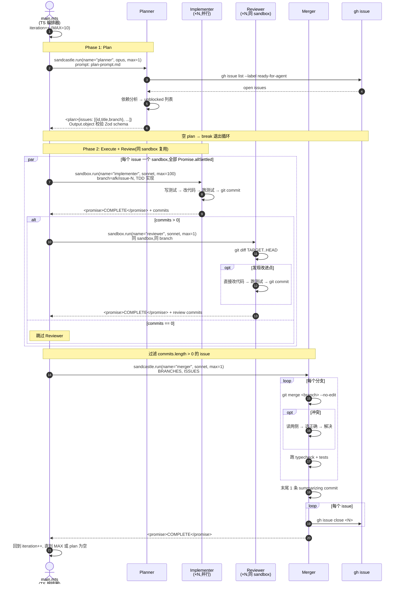

# sandcastle vs afk-issue-loop：编排 Sequence 对比（改造后）

聚焦 Planner → Implementer → Reviewer → Merger 四角色**执行路径本身**的差异，外部载体（sandbox / herdr pane）不在此图。

两张图都展示"一轮"（outer loop 的一次 iteration）；每轮都跑一遍 Execute(+Review) → Merge——Planner **只在开头跑一次**，输出完整 DAG，控制者按拓扑序切片每轮 unblocked（unblocked 集合空即停；用户输入的 issue 范围 = 全部工作面，无硬轮次上限）。

## 图 1：sandcastle `parallel-planner-with-review`（基准）

`main.mts` 作为 TS 编排器；Reviewer **直接改代码并 commit**；`Promise.allSettled` 一次性铺开所有 issue（后期 `MAX_PARALLEL = 4`）；拓扑合并 `git merge --no-edit`。



## 图 2：afk-issue-loop（改造后，当前 Claude 会话扮演 run.ts）

当前 Claude 会话 = `run.ts` 编排器；Planner **只在开头跑一次**输出完整 DAG；控制者按拓扑序每轮切片（unblocked 集合空即停，无硬轮次上限）；Reviewer **直接改代码**不反馈、不复查（一次性自改）；Implementer/Reviewer 跨 issue 信号量 ≤4 并行；`git merge --no-edit` 拓扑合并 + 末尾 summarizing commit；失败 issue 同 worktree 同 branch 无限重试、不传染下游。

```mermaid
sequenceDiagram
    autonumber
    actor Ctl as 控制者<br/>(当前 Claude 会话)
    participant Planner
    participant Impl as Implementer<br/>(每 issue 一个)
    participant Reviewer
    participant Merger
    participant GH as gh issue

    Ctl->>Ctl: 阶段 0: 分支模型检测<br/>TARGET_BRANCH = develop | main

    Note over Ctl,Planner: 阶段 1: Planner(开头 1 次,DAG in 内存)
    Ctl->>Planner: Agent(name=planner, opus-like)
    Planner->>GH: gh issue list --label ready-for-agent --state open
    GH-->>Planner: open issues
    Planner->>Planner: 完整依赖分析(DAG)<br/>{number,title,branch,blocked_by:[]}<br/>kind=gate 单独标记
    Planner-->>Ctl: <plan>{完整 DAG}
    Ctl->>Ctl: 解析 JSON + 校验<br/>存入会话上下文(不持久化)

    Note over Ctl: Planner 不再重跑;循环由控制者驱动

    loop 每轮(轮内 ≤4 并行)
        Note over Ctl: 按 DAG 拓扑序切本轮 unblocked
        Ctl->>Ctl: wt switch -c afk/issue-{N} -b ${TARGET_BRANCH}

        par 每个 issue 一个 worktree,跨 issue ≤4 并行
            Ctl->>Impl: Agent(name=impl-N, sonnet)<br/>worktree 路径 + issue 全文 + CONTEXT
            Impl->>Impl: TDD → 语义原子 commit → 全量测试 → commit(中文)
            alt 实现失败
                Impl-->>Ctl: <promise>COMPLETE</promise>(可能 DURATION 过短/异常)
                Ctl->>Ctl: 失败记录,不传染下游,下一轮同 worktree 同 branch 重试
            else 成功
                Impl-->>Ctl: <promise>COMPLETE</promise>
            end
            Note over Ctl,Reviewer: 同 issue 内严格串行
            alt 分支 commits > 0
                Ctl->>Reviewer: Agent(name=review-N, sonnet)<br/>同 worktree,同 branch
                Reviewer->>Reviewer: git diff ${TARGET_BRANCH}..HEAD
                alt 发现改进点
                    Reviewer->>Reviewer: 直接改代码 → 跑测试 → refine: commit
                end
                Reviewer-->>Ctl: <promise>COMPLETE</promise>
            else commits == 0
                Note over Ctl: 跳过 Reviewer
            end
        end
    end

    Note over Ctl,Merger: 阶段 3: Merger(主仓库,不在 worktree 内)
    Ctl->>Ctl: git checkout ${TARGET_BRANCH}(主仓库)
    Ctl->>Merger: Agent(name=merger, sonnet)<br/>BRANCHES, 主仓库绝对路径
    loop 每个 afk/issue-{N}
        Merger->>GH: gh issue view <N>(取 title/labels)
        Merger->>Merger: git merge <branch> --no-edit
        opt 冲突(禁 -X theirs/ours)
            Merger->>Merger: 读两侧 → 选正确 → git add
        end
        Merger->>Merger: 跑全量测试
        opt 失败(仅合并引入的语法/类型错误)
            Merger->>Merger: 最小补丁 commit → 再跑测试
        end
        Merger->>Ctl: wt remove afk/issue-{N} -D --foreground
    end
    Merger->>Merger: make a single commit summarizing the merge
    loop 已合并 issue(含父 PRD 子全关时)
        Merger->>GH: gh issue close <N>
    end
    Note over Merger: 未合并 issue(如 gate 失败下游)保持 open
    Merger-->>Ctl: <promise>COMPLETE</promise>

    Ctl->>Ctl: 验证:<br/>① gh issue view → CLOSED<br/>② wt list 无残留<br/>(拓扑 merge 不再验证 1-parent)
    Note over Ctl: 回到 DAG 拓扑序切片下一轮<br/>本轮 unblocked 空 → 停
```

## 一眼对照（改造后）

| 维度 | sandcastle（图 1） | afk-issue-loop 改造后（图 2） |
|------|------------------|-------------------------------|
| 编排器 | TS 脚本 `main.mts` | 当前 Claude 会话（控制者） |
| Planner 节奏 | 每轮重 Plan（MAX_ITERATIONS=10） | **仅开头 1 次**，输出完整 DAG |
| 切片方式 | Planner agent 输出 unblocked 列表 | 控制者按 DAG 拓扑序运行时切片 |
| 终止条件 | MAX_ITERATIONS 或 plan 为空 | **本轮 unblocked 为空**（DAG 拓扑耗尽即停） |
| Reviewer 角色 | 自己改 + commit | 自己改 + commit（**对齐**） |
| 反馈闭环 | 无 | 无（**对齐**） |
| 失败处理 | 失败 = 过滤掉，不进 Merger，不重试 | **同 worktree 同 branch 无限重试，不传染下游** |
| 并行度 | `Promise.allSettled`（后期 ≤4） | 跨 issue 信号量 ≤4 |
| Implementer/Reviewer 关系 | 同 sandbox，串行 | **同 worktree 同 branch 串行**（**对齐**） |
| Commit 粒度 | TDD 自然节奏 | **语义原子 commit**（大改先审 diff 拆分） |
| 合并 | `git merge --no-edit`（拓扑） | `git merge --no-edit`（拓扑，**对齐**） |
| 末尾 commit | summarizing commit（无模板） | summarizing commit（无模板，**对齐**） |
| 分支清理 | 模板未明文 | `wt remove afk/issue-{N} -D --foreground` |
| 冲突策略 | 模板未禁 `-X` | 红线明文禁 `-X theirs/ours` |
| 验证 | 仅测 + 关 issue | 2 件：issue closed / wt list 干净（**不再验证 1-parent**） |
| 关 issue | 统一由 Merger | 统一由 Merger（**对齐**） |
| 远端操作 | 本地（不 push 不建 PR） | 本地（不 push 不建 PR，**对齐**） |

## 仍存的差异（执行层面）

| 维度 | sandcastle | afk-issue-loop 改造后 |
|------|------------|---------------------|
| 载体 | Docker sandbox（bind-mount 或 isolated） | subagent（默认）/ herdr pane |
| 超时机制 | 引擎层双 timeout（idle 10 分钟 + completion grace 60 秒）+ 每生命周期步骤独立超时 | 宿主 Agent 自带超时 + 控制者后台计时器（按复杂度分级，见 REFERENCE.md） |
| 失败节点语义 | 永久丢弃（不传染也不重试） | 无限重试（不传染但重试） |
| 实施侧测试 | fixture sandbox + GitHub PR 模式 | fixture GitHub issue + worktree 隔离 |

## 引用

- 调研笔记：`docs/research/sandcastle-original-design.md`
- afk 新协议：`skills/personal/afk-issue-loop/SKILL.md`、`REFERENCE.md`、`reference/{planner,implementer,reviewer,merger}-prompt.md`