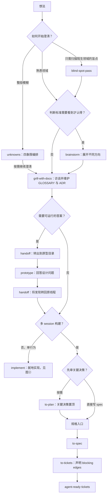
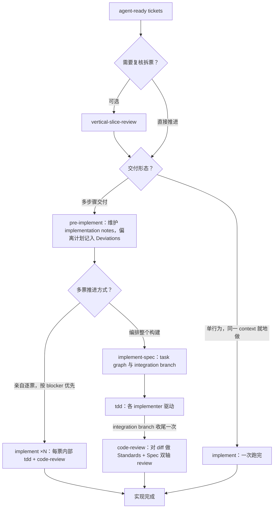
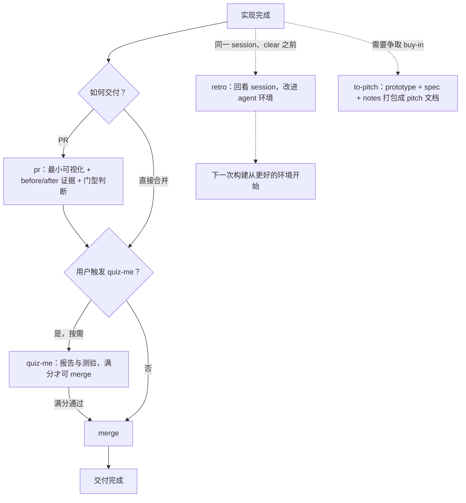
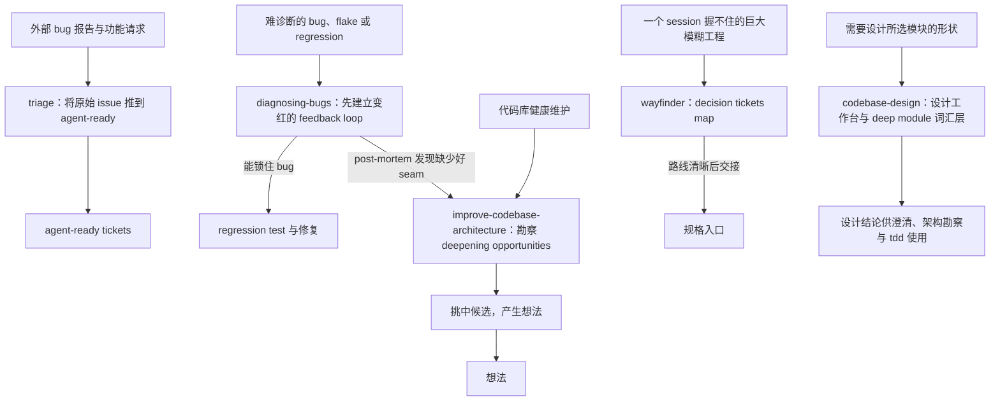
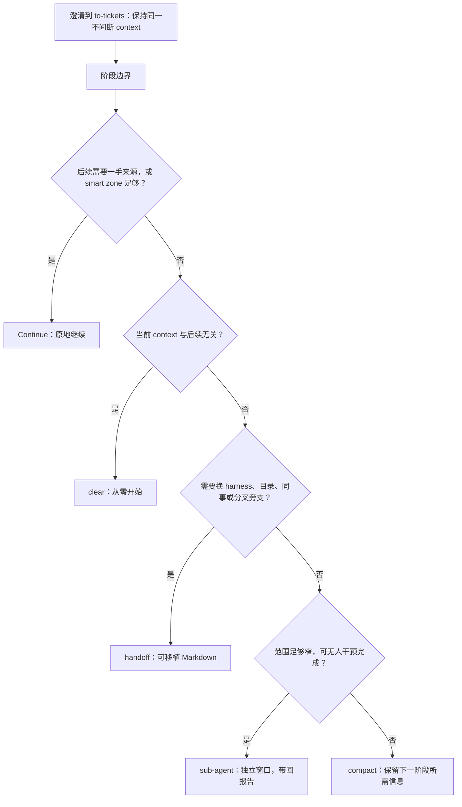

# Skill 使用地图

不确定时 → [ask-rolex](../skills/engineering/ask-rolex/SKILL.md)。首次工程 flow 前运行 [setup-rolex-skills](../skills/engineering/setup-rolex-skills/SKILL.md)，配置 tracker、标签与文档布局。

本图是导航，不是必跑清单。流程以 [ask-rolex](../skills/engineering/ask-rolex/SKILL.md)（上游 [ask-matt](https://github.com/mattpocock/skills/tree/main/skills/engineering/ask-matt) 的中文化改编）为准；阶段划分参考 [Thariq 的 pre / during / post implementation 框架](https://x.com/trq212/status/2073100352921215386)。同名出口节点连接各图。`clear`、`compact`、sub-agent、merge 与实际 QA 是操作，不是 skill。

## ① 实现前：想法 → tickets

`unknowns` 是整段模糊时的编排入口，与单跑盲点扫描、头脑风暴互为替代。`to-plan` 是 spec 前的可选审阅，不是循环关卡。**`to-tickets` 产出的票已 agent-ready，不再 triage。** 工程量大到一个 session 握不住？不走这条标准路线，见图④ `wayfinder`。

图中技能：[unknowns](../skills/Thariq/unknowns/SKILL.md) · [blind-spot-pass](../skills/Thariq/blind-spot-pass/SKILL.md) · [brainstorm](../skills/Thariq/brainstorm/SKILL.md) · [grill-with-docs](../skills/engineering/grill-with-docs/SKILL.md) · [handoff](../skills/productivity/handoff/SKILL.md) · [prototype](../skills/engineering/prototype/SKILL.md) · [to-plan](../skills/Thariq/to-plan/SKILL.md) · [to-spec](../skills/engineering/to-spec/SKILL.md) · [to-tickets](../skills/engineering/to-tickets/SKILL.md)。

## ② 实现中：tickets → 实现完成

逐票 `implement` 之间 `clear`，每票从自包含 ticket 开始。`pre-implement` 面向多步骤交付：无论规划多充分，实现中总会有 unknown unknowns 迫使偏离——按保守选项执行并记入 Deviations，供下一次尝试学习。

图中技能：[vertical-slice-review](../skills/personal/vertical-slice-review/SKILL.md) · [pre-implement](../skills/Thariq/pre-implement/SKILL.md) · [implement](../skills/engineering/implement/SKILL.md) · [implement-spec](../skills/engineering/implement-spec/SKILL.md) · [tdd](../skills/engineering/tdd/SKILL.md) · [code-review](../skills/engineering/code-review/SKILL.md)。

## ③ 实现后：交付与收尾

PR 文案、测验、merge 是三个不同节点。`quiz-me` 只有用户触发时才成为满分合并门禁，不是所有交付的强制步骤。`retro` 回看的是整个 session（含澄清与实现），唯一硬约束是**在同一 session 里、`/clear` 之前**；错过窗口就改为读取原 session 日志。`to-pitch` 不依赖 retro，交付成果需要 reviewer 或专家认可时使用。

图中技能：[pr](../skills/engineering/pr/SKILL.md) · [quiz-me](../skills/Thariq/quiz-me/SKILL.md) · [retro](../skills/engineering/retro/SKILL.md) · [to-pitch](../skills/Thariq/to-pitch/SKILL.md)。

## ④ 其他入口：triage、诊断、探索与架构维护

架构勘察 → 挑中候选 → **产生想法** → 图① `grill-with-docs`；`codebase-design` 不是这条路径的终点，而是设计所选对象的工作台与底层词汇。`triage` 只处理非自己创建的原始 issue。`wayfinder` 产出 decisions 而非 deliverables，通常在 `to-spec` 汇入；只有工程量确实很小时才直接 `implement`。

图中技能：[triage](../skills/engineering/triage/SKILL.md) · [diagnosing-bugs](../skills/engineering/diagnosing-bugs/SKILL.md) · [wayfinder](../skills/engineering/wayfinder/SKILL.md) · [improve-codebase-architecture](../skills/engineering/improve-codebase-architecture/SKILL.md) · [codebase-design](../skills/engineering/codebase-design/SKILL.md)。

## ⑤ Context 与阶段交接

在 `to-tickets` 完成前不主动 clear 或 compact；若接近 smart zone 上限，在最近阶段边界 compact，而非硬撑。阶段中途只继续或拆给 sub-agent；`handoff` 也可用于中途分叉旁支。原型的双向交接见图①，逐票 clear 与构建后 retro 见图②图③。

图中技能：[handoff](../skills/productivity/handoff/SKILL.md)。决策顺序详见 [Phase boundaries](../skills/engineering/ask-rolex/PHASE-BOUNDARIES.md)。

## 辅助技能：按场景取用，不构成额外流水线

| 场景 | Skill | 作用或输入去向 |
|---|---|---|
| 没有工作目录 | [grill-me](../skills/productivity/grill-me/SKILL.md) | 无状态访谈；有仓库时优先 grill-with-docs。 |
| 需要直接 interview 原语 | [grilling](../skills/productivity/grilling/SKILL.md) | grill-me、grill-with-docs 等的底层轮次与 frontier。 |
| 领域词语含糊或过载 | [domain-modeling](../skills/engineering/domain-modeling/SKILL.md) | grill-with-docs 驱动的词汇纪律，维护 GLOSSARY 与 ADR。 |
| 缺背景事实 | [research](../skills/engineering/research/SKILL.md) | 背景 agent 调查 primary sources；带引用的文件作为 grill-with-docs 的输入。 |
| 信息在别人脑子里 | [to-questionnaire](../skills/productivity/to-questionnaire/SKILL.md) | 发问卷；回收答案供 grill-with-docs 或 to-spec 使用。 |
| 高影响多方案或关键权衡不明 | [ask-advisor](../skills/personal/ask-advisor/SKILL.md) | 强模型顾问辅助决策；拿到结论后继续原流程。 |
| 想知道最自然的后续请求 | [next-steps](../skills/personal/next-steps/SKILL.md) | 手动调用，预测最多三个请求，展示标题与完整 prompt；回复编号直接执行。不做待办规划，留在当前会话；[handoff](../skills/productivity/handoff/SKILL.md) 用于转移 context。 |
| 拆票或 triage 后，需要无人值守批量交付 | [afk-issue-loop](../skills/personal/afk-issue-loop/SKILL.md) | 用户手动启动独立脚本，处理就绪票；started 不等于交付完成，可结束发起会话。不是 implement-spec 的后置步骤。 |
| 只有人能完成的凭据、设施或 dashboard 操作 | [wizard](../skills/engineering/wizard/SKILL.md) | 生成交互脚本，保留真正需要 human in the loop 的步骤。 |
| 任意 skill 对话中没听懂一条消息 | [wait-what](../skills/productivity/wait-what/SKILL.md) | 用缺失 context 与项目词汇重新讲解。 |
| 跨 session 学习概念 | [teach-me](../skills/productivity/teach-me/SKILL.md) | 以当前目录为有状态学习工作区。 |
| 写 agent 文档或 skill | [writing-for-agents](../skills/productivity/writing-for-agents/SKILL.md) · [writing-great-skills](../skills/productivity/writing-great-skills/SKILL.md) | 文档与 skill 编写参考。 |
| 浏览器或网页任务 | [browser-tools](../skills/personal/browser-tools/SKILL.md) | 浏览器与搜索工具的路由入口。 |
| gh 或 GitHub API 请求 | [github-api-rate-limits](../skills/personal/github-api-rate-limits/SKILL.md) | 管理 REST 与 GraphQL 独立预算，尤其分页、循环、批量调用。 |
| 清理已合并分支 | [clean-branches](../skills/personal/clean-branches/SKILL.md) | Git 运维，不是 retro 的产物。 |
