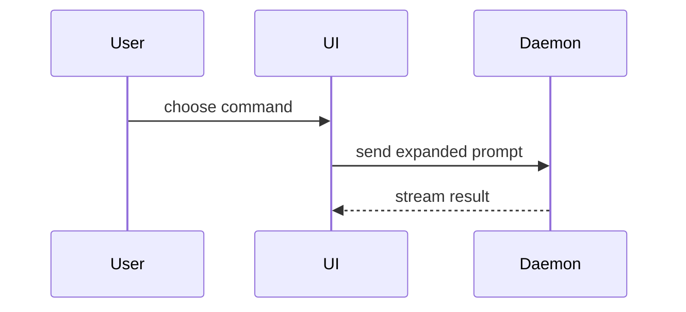

用以下模板撰写 PR body：

```markdown
## Summary

<diagram, diff-sketch, or tree>

## Evidence

- **Before:** <screenshot/output/failing test run>
  **After:** <screenshot/output/passing test run>

## Merge Danger

**Door:** <one-way or two-way>

<optional: description>

**Blast Radius:** <one-word description>

<optional: potential ramifications of merge>
```

## Sections

跳过所有 preamble，行文保持简短。使用 `GLOSSARY.md` 中用户的领域语言。

### Summary

选取能把关键点讲清楚的最小视图。

- 用 pseudocode 展示逻辑或算法：

```text
on(save)
  if content is unchanged
    return cached result
  write new content
  return fresh result
```

- 用 call tree 展示运行时控制流：

```text
submitForm
  createSession
    persistPrompt
    launchAgent
  navigateToSession
```

- 用 component tree 展示 UI 结构，包含重要的 state 与模块边界：

```text
<SessionPage> (apps/example/src/routes/session.tsx)
  useSessionEvents()
  <SessionToolbar>
    <RunSkillButton> (packages/ui)
```

- 用浅层 file tree 展示文件职责或大范围重构：

```text
src/
├── commands/       # parses user actions
├── sessions/       # owns session state
└── transport/      # sends API requests
```

- 用 Mermaid 展示组件交互、控制流或数据流：



- 当重点在于"改了什么"且周围的形态已经存在时，用 `diff`。让 diff 的形态与主题匹配。

组件改动：

```diff
 <SessionPage>
   useSessionEvents()
   <SessionToolbar>
+    <RunSkillButton />
   <SessionTimeline>
+    <SkillResultCard />
```

文件布局改动：

```diff
 src/
 ├── commands/
+│   └── show-me.ts       # expands the slash command
 ├── sessions/
-└── transport.ts
+└── transport/
+    ├── client.ts
+    └── stream.ts
```

call tree 或 call stack 改动：

```diff
 submitForm
   createSession
     persistPrompt
+    expandSkillMention
     launchAgent
-  navigateToSession
+  navigateToSession
+    subscribeToEvents
```

state 或控制流改动：

```diff
 on(save)
-  write content
+  if content is unchanged
+    return cached result
+  write new content
+  invalidate cache
```

- 当大部分内容都是新的、省略上下文会掩盖归属或顺序、或用户需要一个可复制的目标形态时，展示整个代码块：

```ts
function expandSkill(command: string): string {
  const skillName = command.slice(1);
  return `use the ${skillName} skill`;
}
```

#### Guidance

把每个可视化紧挨着它所支撑的简短文字摆放。只保留回答用户当前问题所需的 calls、files、props、states、boundaries，以及解决当前讨论点所需的选项。

你可以只用其中一种，也可以用几种，但你不太可能全用上。运用判断力，别让用户被淹没。

### Evidence

证明改动确实有效的具体证据。展示 before 与 after。

截图是 S-tier——前提是环境已配置好且改动是视觉性的。

基于执行的证据是 A-tier。测试结果、console 输出。用 pseudocode 展示改动前失败、改动后通过的具体测试。

### Merge Danger

说明这是一扇 one-way door 还是 two-way door。two-way door 可以走回来，one-way door 不行。回滚成本低的 PR 风险更低。涉及破坏性操作或难以逆转决策的改动是 one-way door。

Blast radius 是这个 PR 所引入改动的潜在影响或波及范围。考虑所有可能性。例如布局偏移、对消费方的破坏、移动端响应式等。
